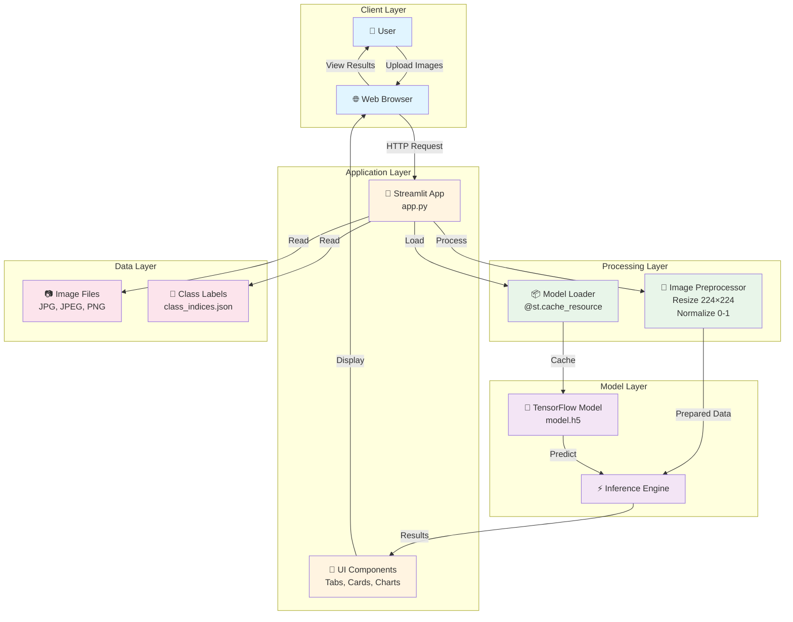
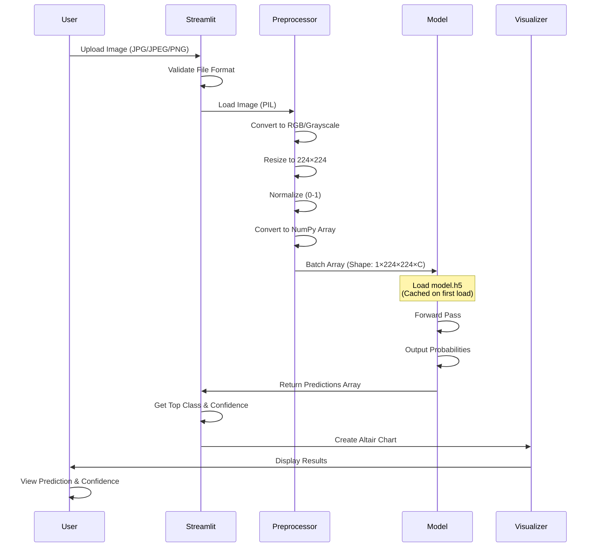
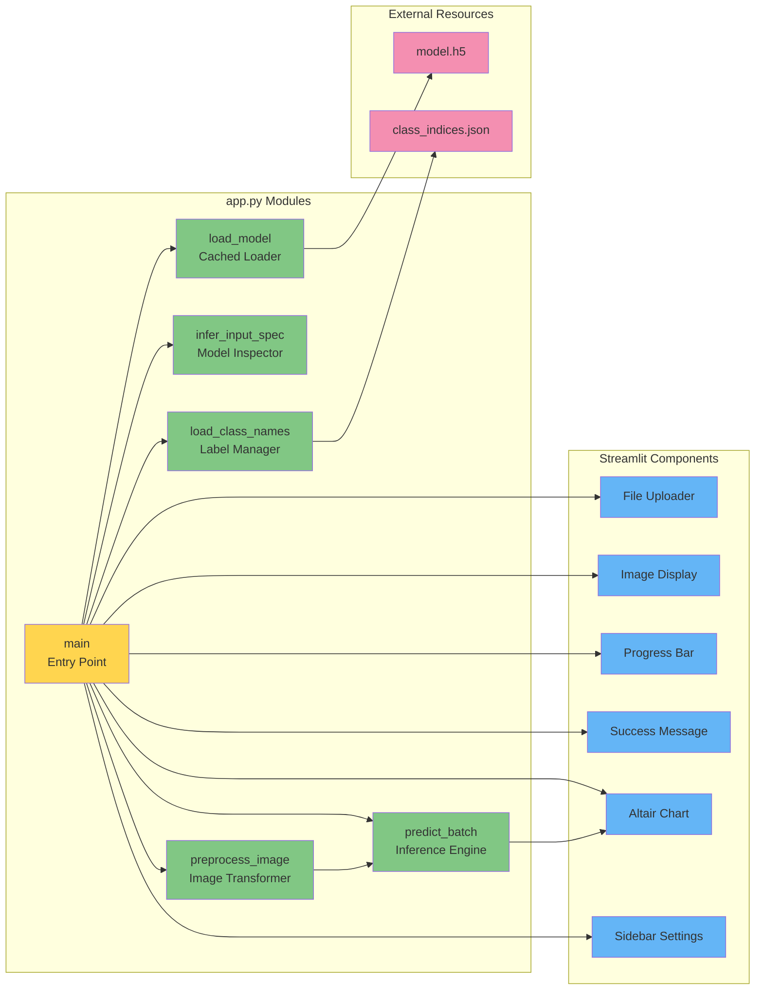

 VisionCraft - A Lightweight Convolutional Neural Network for Real-Time Image Classification


A modern, professional  application for image classification using TensorFlow/Keras models. Upload images and get instant predictions with beautiful visualizations.

**👩‍💻 Made by Falguni Shinde**

---

## 📋 Project Overview

| **Attribute** | **Description** |
|---------------|------------------|
| **Project Name** | VisionCraft |
| **Purpose** | Image Classification using Deep Learning |
| **Supported Formats** | JPG, JPEG, PNG |
| **Image Preprocessing** | Resize to 224×224, Normalize (0-1) |
| **Deployment** | Local/Cloud (Streamlit Cloud, Heroku, etc.) |

---

## 🛠️ Technology Stack

| **Component** | **Technology** | **Version** | **Purpose** |
|---------------|----------------|-------------|-------------|
| **Deep Learning** | TensorFlow | ≥2.12.0 | Model loading and inference |
| **Image Processing** | Pillow (PIL) | ≥9.5.0 | Image loading and manipulation |
| **Data Processing** | NumPy | ≥1.24.0 | Array operations and preprocessing |
| **Visualization** | Altair | ≥5.0.0 | Interactive confidence bar charts |
| **Data Analysis** | Pandas | ≥2.0.0 | Data manipulation for charts |
| **Language** | Python | 3.8+ | Core programming language |

---

## 📁 Project Structure

| **File/Directory** | **Description** |
|--------------------|-----------------|
| `app.py` | Main Streamlit application file |
| `class_indices.json` | Optional: Class label mappings (JSON) |
| `requirements.txt` | Python dependencies |
| `README.md` | Project documentation |
| `image classification.ipynb` | Optional: Model training notebook |

---

## ✨ Features

| **Feature** | **Description** |
|-------------|-----------------|
| **Single Image Upload** | Upload and classify one image at a time |
| **Batch Upload** | Upload multiple images for batch processing |
| **Model Caching** | Efficient model loading with `@st.cache_resource` |
| **Auto Preprocessing** | Automatic resize (224×224) and normalization (0-1) |
| **Class Labels** | Support for custom class names via JSON or manual input |
| **Confidence Visualization** | Interactive Altair bar charts with tooltips |
| **Progress Indicators** | Real-time progress bars and success messages |
| **Responsive Design** | Works on desktop and tablet devices |
| **Dark Mode Support** | Automatic theme detection |

---

## 🏗️ System Architecture

### High-Level Architecture Diagram



---

## 🔄 Data Flow Architecture



---

## 🧩 Component Architecture



---

## 📊 Model Specifications

| **Specification** | **Value** | **Notes** |
|-------------------|-----------|-----------|
| **Input Size** | 224 × 224 pixels | Fixed preprocessing size |
| **Input Channels** | 1 (Grayscale) or 3 (RGB) | Auto-detected from model |
| **Normalization** | 0.0 - 1.0 | Pixel values divided by 255 |
| **Model Format** | Keras H5 | SavedModel also supported |
| **Output** | Probability Distribution | Softmax or Sigmoid |
| **Batch Processing** | Supported | Multiple images processed together |

---

## 🚀 Installation & Setup

### Prerequisites

| **Requirement** | **Version** |
|-----------------|-------------|
| Python | 3.8 or higher |
| pip | Latest version |

### Installation Steps

1. **Clone or download the project**
   ```bash
   cd VisionCraft
   ```

2. **Install dependencies**
   ```bash
   pip install -r requirements.txt
   ```

3. **Run the application**
   ```bash
    run app.py
   ```

---

## 📖 Usage Guide

| **Step** | **Action** | **Description** |
|----------|------------|-----------------|
| 1 | Launch App | Run ` run app.py` |
| 2 | Select Tab | Choose "Single Image" or "Batch Upload" |
| 3 | Upload Image(s) | Drag & drop or browse for JPG/JPEG/PNG files |
| 4 | View Results | See prediction, confidence, and bar chart |
| 5 | Adjust Settings | Use sidebar to customize class labels |

---

## 🎨 UI Components

| **Component** | **Location** | **Function** |
|---------------|--------------|--------------|
| **Hero Banner** | Top of page | Gradient header with app title |
| **File Uploader** | Main content | Image upload interface |
| **Image Preview** | Results section | Display uploaded image |
| **Prediction Card** | Results section | Show top class and confidence |
| **Progress Bar** | Results section | Visual confidence indicator |
| **Bar Chart** | Results section | Interactive Altair visualization |
| **Success Message** | Results section | Green alert with prediction |
| **Sidebar** | Left panel | Settings and app information |
| **Footer** | Bottom | Author credit |

---

## 🔧 Configuration

| **Setting** | **Location** | **Options** |
|------------|--------------|-------------|
| **Class Labels** | Sidebar → Text Area | Comma-separated list or JSON file |
| **Input Size** | Hardcoded | 224×224 (changeable in code) |
| **Theme** | Auto-detected | Light/Dark based on system |

---

## 📈 Performance Considerations

| **Aspect** | **Optimization** |
|------------|------------------|
| **Model Loading** | Cached with `@st.cache_resource` (loads once) |
| **Batch Processing** | Multiple images processed in single batch |
| **Image Preprocessing** | Efficient NumPy operations |
| **Chart Rendering** | Altair for fast, interactive visualizations |

---

## 🐛 Troubleshooting

| **Issue** | **Solution** |
|-----------|--------------|
| Import errors | Run `pip install -r requirements.txt` |
| Image format error | Use JPG, JPEG, or PNG only |
| Low confidence | Check if model matches your image classes |
| Memory issues | Reduce batch size or image resolution |

---

## 📝 License & Credits

| **Item** | **Details** |
|----------|-------------|
| **Author** | Falguni Shinde |
| **ML Library** | TensorFlow (Apache 2.0) |
| **License** | Check individual dependencies |

---

## 🔮 Future Enhancements

| **Feature** | **Status** | **Priority** |
|-------------|------------|--------------|
| Model comparison | Planned | Medium |
| Export predictions | Planned | Low |
| Custom preprocessing | Planned | Medium |
| REST API endpoint | Planned | High |
| Docker containerization | Planned | Medium |

---

## 📞 Support

For issues, questions, or contributions, please refer to the project repository or contact the developer.

**👩‍💻 Made by Falguni Shinde**


